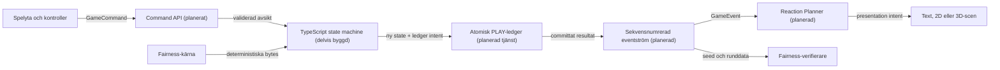
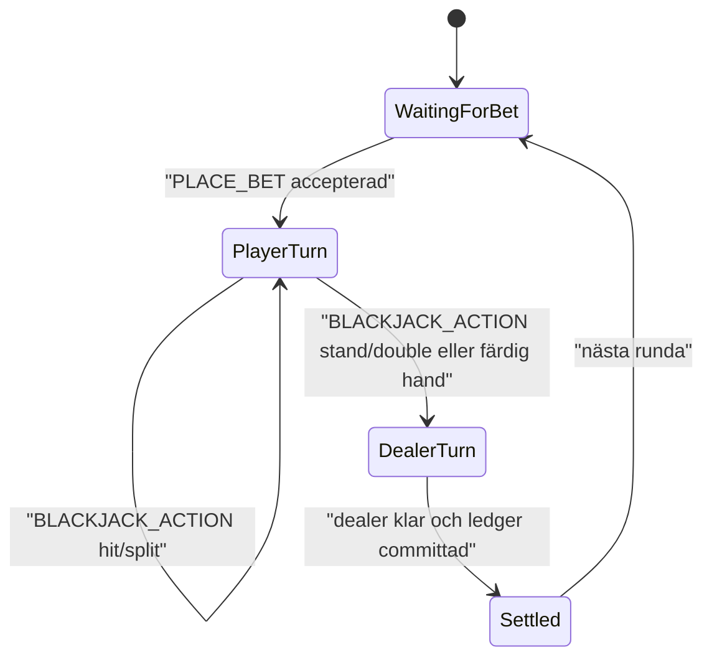
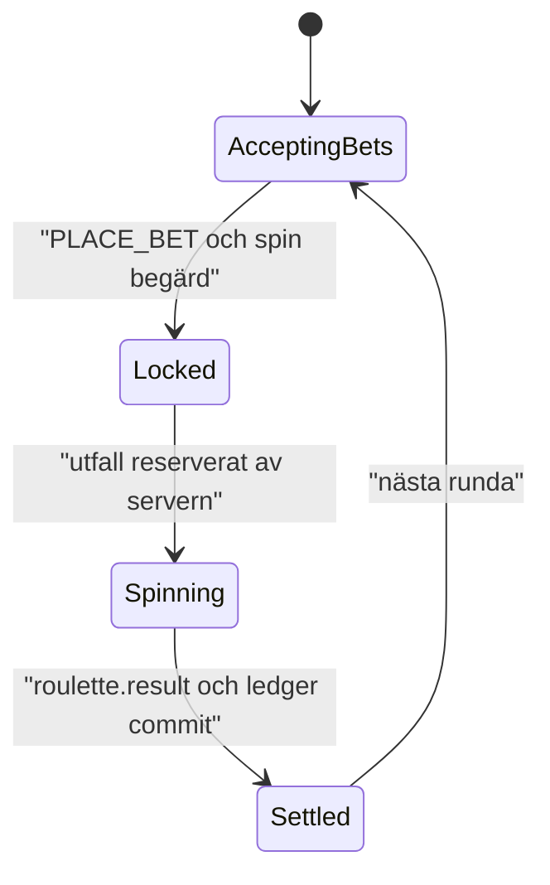

# System canvas

Det här är den mänskliga kartan över hur blackjack och europeisk roulette ska hänga ihop från spelarens knapptryckning till serverbeslut, bokföring, event och presentation. Den körbara motsvarigheten finns i [`packages/system-model/models/play-money-mvp.json`](../packages/system-model/models/play-money-mvp.json) och kan visas som en enkel, levande textvy på [`/system`](http://localhost:3000/system) när webbappen körs lokalt.

Canvasen är navigationshjälp, inte en alternativ implementation. Spelregler, nätverksformat, databasschema och fairness bestäms av sina respektive auktoritativa källor enligt [engineeringavtalet](ENGINEERING.md).

## Så läser man status

Tre ord används medvetet olika:

- **Implementerad** betyder att funktionen finns i runtime i den utpekade källfilen.
- **Kontrakterad** betyder att ett Zod-format och normalt en fixture finns, men inte nödvändigtvis någon serverroute eller realtime-leverans.
- **Planerad** betyder att modellen beskriver önskat gränssnitt eller flöde som ännu inte finns i runtime.

Den maskinläsbara modellen är mer exakt och delar status i fyra oberoende axlar: `runtime`, `contract`, `verification` och `lifecycle`. Det hindrar exempelvis ett Zod-kontrakterat event från att av misstag beskrivas som implementerat.

## Systemet i en bild

Backend avgör alltid state, utfall, payout och saldo. Frontend får endast skicka spelarens avsikt och presentera serverns semantiska events. Animationen får aldrig skapa ett konkurrerande visuellt utfall.

## Vad som faktiskt finns nu

| Yta | Status | Sanning och kommentar |
| --- | --- | --- |
| `GET /health` | Implementerad | Ad hoc-svar i `apps/game-server/src/app.ts`, med servertest. |
| `GET /v1/status` | Implementerad | Publicerar play-money-läge och rulesetprojektioner, med servertest. |
| Socket.IO `server.ready` | Implementerad | Bekräftar anslutning men är ännu inte Zod-kontrakterad. |
| Commands och domänevents | Kontrakterade | Zod v1 och fixtures finns i `packages/contracts`; ingen command-route eller `game.event`-ström kör dem ännu. |
| Blackjackmotor | Delvis implementerad | Rulesetprojektion och handvärdering finns; komplett state machine och settlement saknas. |
| Roulettemotor | Delvis implementerad | Rulesetprojektion och färgmappning finns; betmodell, state machine och payout saknas. |
| Fairness | Implementerad kärna | Deterministisk byte-stream, unbiased mappning och golden vectors finns; rundorkestrering återstår. |
| PLAY-ledger | Delvis implementerad | Databasschemat och skydd finns; atomisk command-/settlementtjänst återstår. |
| Webbpresentation | Delvis implementerad | En responsiv 3D-scaffold finns; den reagerar ännu inte på inspelade `GameEvent`. |
| `/system` | Dokumentationsyta | Visar den validerade systemmodellen och scenarierna; den är inte ett spel eller driftbevis. |

Använd den levande [`/system`](http://localhost:3000/system)-vyn för aktuell komponentstatus och två stegvisa textscenarier. Läs JSON-modellen när en annan LLM eller ett verktyg behöver samma karta i maskinläsbar form.

## Transporten vi bygger mot

De två befintliga GET-routes ovan är de enda implementerade HTTP-ytorna. Följande transport är uttryckligen **planerad**:

| Gränssnitt | Syfte | Status |
| --- | --- | --- |
| `POST /v1/tables/{tableId}/commands` | Gemensam, idempotent ingress för alla `GameCommand`. | Planerad; Zod-payloads finns. |
| `GET /v1/tables/{tableId}/snapshot` | Auktoritativ återställning vid anslutning eller sekvensgap. | Planerad; ett minimalt snapshotkontrakt finns. |
| Socket.IO `game.event` | En kanal för sekvensnumrerade `GameEvent`. | Planerad; eventunionen finns. |
| Socket.IO `table.snapshot` | Snapshot vid reconnect eller saknade events. | Planerad; transporten saknas. |

Animationer reagerar alltså på **eventtyper i `game.event`**, inte på en egen endpoint per animation. Det håller nätverksprotokollet stabilt när Emil byter från text till CSS, GLB eller en annan renderer.

## Commands till presentation

### Blackjack

Tillstånden ovan är en plan för den kommande state machinen, inte dagens runtime-API.

1. Webben skapar `PLACE_BET` och väntar på serverbekräftelse.
2. Servern validerar kontrakt, behörighet, idempotens och saldo.
3. Blackjack-state-machinen använder injicerade fairness-bytes och ruleset `mvp-v1`.
4. Runda, fairness och ledger committas atomiskt.
5. Servern skickar bland annat `round.started`, `blackjack.card.dealt` och slutligen `round.settled`.
6. Frontend mappar eventen till exempelvis bordstart, deal, kortvisning och resultatreaktion.

Det nuvarande v1-kontraktet innehåller tyvärr fortfarande `card` även när `faceUp` är `false`. Frontend måste ignorera värdet. Innan någon spelserver börjar emittera kort-events ska en versionshanterad v2 ta bort fältet för nedvända kort och lägga till ett auktoritativt reveal-event eller en tillräcklig snapshot.

### Europeisk roulette

Även dessa tillstånd är planerade, inte implementerade routes eller publika eventnamn.

1. Bettingmattan samlar spelarens marker utan att räkna fram ett utfall.
2. Servern validerar en framtida strukturerad betmodell och reserverar insatsen atomiskt.
3. `ROULETTE_SPIN` begär settlement; klienten skickar aldrig önskat pocketnummer.
4. Fairness-kärnan härleder ett unbiased värde från 0 till 36.
5. `roulette.result` är enda sanningen för var hjulet och bollen ska landa.
6. `round.settled` uppdaterar resultat, payout och saldo efter databascommit.

## Eventmatris för Emil

Emil kan bygga presentationen mot incheckade fixtures innan servertransporten finns. Mappningen ska ligga i frontendens presentationslager och vara uttömmande typkontrollerad; den får inte kopieras till spelmotorn.

| Kontrakterad eventtyp | Frontend får presentera | Frontend får inte göra |
| --- | --- | --- |
| `round.started` | Nollställ scenen, visa commitment och starta bordets rundläge. | Anta kort, pocket eller payout. |
| `blackjack.card.dealt` | Animera deal till angiven mottagare/hand; visa endast `card` när `faceUp` är `true`. | Läsa eller gissa ett dolt kort. |
| `roulette.result` | Bromsa hjul och boll mot `payload.pocket`; erbjuda textfallback. | Slumpa eller korrigera vinnande pocket lokalt. |
| `round.settled` | Visa outcome, payout, nytt saldo och verifieringsmöjlighet. | Räkna auktoritativt saldo eller settle:a rundan. |
| `reaction.cue` | Välja en godkänd reaktion från actor, mood och intensity. | Ändra spelstate eller låta AI skapa godtycklig kod/animation. |

Fixtures finns i [`packages/contracts/fixtures/v1`](../packages/contracts/fixtures/v1). Systemmodellens blackjack- och roulettescenarier binder ihop commands, systemsteg, event och presentations-cues. De är dokumentationsscenarier, inte ännu fullständiga inspelningar från spelservern.

## Kända gap i kontrakt v1

V1 är en bra gräns för scaffolden men ännu inte tillräcklig för komplett spel:

- `PLACE_BET` anger spel och belopp men saknar roulettens betpositioner och bettyper.
- `GameSnapshot` saknar fas, aktiva händer, dealerstate, roulettebets och tillåtna actions; det räcker inte för full reconnect.
- Det saknas kontrakterad command-ack, avvisningsorsak och idempotent replay-status.
- Blackjack saknar ett uttryckligt reveal-event och settlement per hand efter split.
- Blackjack-v1 kräver fortfarande kortvärdet även för `faceUp:false`; det får inte användas i runtime innan ett säkert v2-kontrakt finns.
- Roulette saknar flera samtidiga bettickets och payoutdetaljer per bet.
- `reaction.cue` saknar ännu source-event, gesture/speech-intent, prioritet och avbrottsregel.
- Eventlagring, sekvensåterläsning och snapshottransport är planerade men inte implementerade.

Ett gap löses först i den auktoritativa Zod-källan, med schema-/fixtureuppdatering och tester. En kompatibilitetsbrytning ska versionshanteras; den får inte döljas i UI-kod eller en dokumentationstabell.

## Spelmotorbeslut

Vi bygger en egen, ren TypeScript-motor i `packages/game-core` för båda spelen. Den ska bestå av deterministiska state machines som tar tidigare state, validerat command, ruleset och injicerad fairness-data och returnerar ny state, domänevents och ledger-intent. Paketet ska inte känna till HTTP, Socket.IO, Supabase, GLB, React eller AI.

Externa GitHubprojekt används endast som referenser för state-machine-idéer, regler, UX och visuell inspiration. De importeras inte som auktoritativ motor och får aldrig äga RNG, payout eller saldo. Den tekniska bedömningen finns i [Spelmotor, 3D-avatarer och AI](PRESENTATION_AI.md).

## Branchgräns för utseende

Emils utseendebranch ska vara kortlivad och skapas från uppdaterad `main`. Den kan normalt ändra:

- `apps/web/src/**`;
- `apps/web/public/**` när mappen finns;
- webbspecifika tester och små presentationsanteckningar.

Den ska konsumera `@spelsajt/contracts`, `@spelsajt/system-model` och fixtures utan att ändra deras format. Den ska normalt inte röra:

- `packages/contracts`, `packages/system-model`, `packages/game-core`, `packages/fairness` eller `packages/config`;
- `apps/game-server` eller `supabase`;
- rootens packagefiler eller lockfil.

Om presentationen upptäcker ett kontraktsgap görs en liten, separat och gemensamt granskad kontraktsändring först. Efter merge rebaseras utseendebranchen. Behåll `/system`, reduced-motion-fallback och textscenarier fungerande även när den visuella designen byts ut.

## När kartan ska ändras

Uppdatera den maskinläsbara modellen när en nod, transport, cue, scenario eller mognadsstatus faktiskt ändras. Kör därefter schemagenerering och hela kvalitetsgrinden. Markdown uppdateras endast när arkitektur, ansvar eller användarbeteende behöver förklaras; den ska inte manuellt duplicera varje kontraktsfält.
