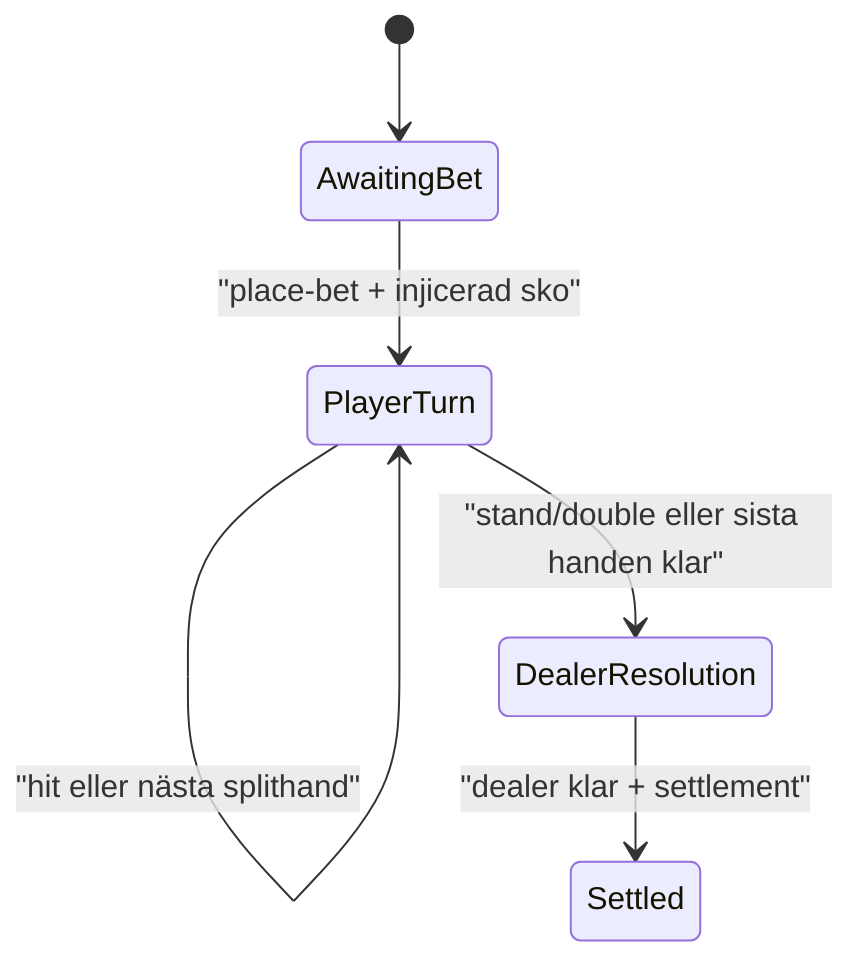
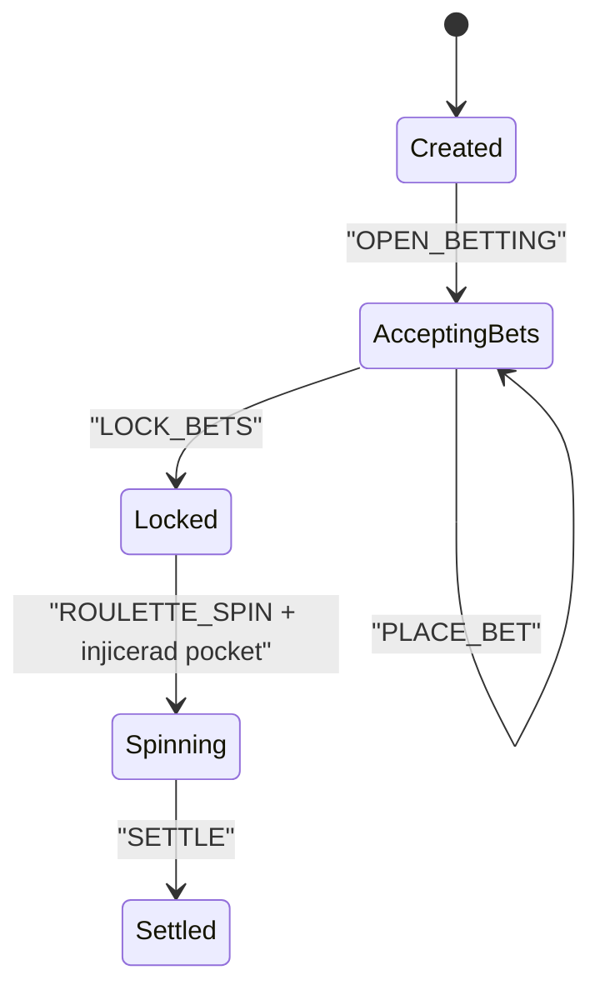

# System canvas

Det här är den mänskliga kartan över hur blackjack och europeisk roulette hänger ihop från spelarens knapptryckning till serverbeslut, bokföring, event och presentation. Den körbara motsvarigheten finns i [`packages/system-model/models/play-money-mvp.json`](../packages/system-model/models/play-money-mvp.json) och visas som en enkel textvy på [`/system`](http://localhost:3000/system) när webbappen körs lokalt.

Canvasen är navigationshjälp, inte en alternativ implementation. Den aktiva play-money-profilen är `mvp-v2`. `mvp-v1` är bevarad som historisk, publicerad profil och ändras inte i efterhand. Spelregler, nätverksformat, databasschema och fairness bestäms av sina respektive auktoritativa källor enligt [engineeringavtalet](ENGINEERING.md).

## Så läser man status

Tre ord används medvetet olika:

- **Implementerad** betyder att funktionen finns i runtime i den utpekade källfilen.
- **Kontrakterad** betyder att ett Zod-format och fixtures finns, men inte nödvändigtvis någon serverroute eller realtime-leverans.
- **Planerad** betyder att gränssnittet eller flödet ännu inte finns i runtime.

Direkta motortester bevisar motorbeteende, inte serverorkestrering. En kontrakterad v2-route är därför fortfarande planerad tills game-server faktiskt validerar, persisterar och levererar den.

## Systemet i en bild

```mermaid
flowchart LR
    UI["Spelyta och kontroller"]
    API["Command API /v2 (implementerat, auth + Postgres)"]
    CORE["Blackjack + roulette TS state machines (implementerade)"]
    FAIR["Fairness-kärna"]
    TX["Serveradapter + atomisk Postgres-ledger (implementerade)"]
    EVENTS["Persistenta sekvensnumrerade v2-events + Socket.IO"]
    PLAN["Reaction Planner (implementerad frontend)"]
    SCENE["Eventstyrd text/3D-scen (delvis implementerad)"]
    VERIFY["Fairness-verifierare"]

    UI -->|"GameCommandV2"| API
    API -->|"validerad avsikt"| CORE
    FAIR -->|"injicerad sko eller pocket"| CORE
    CORE -->|"ny state + domänevents + ledger intent"| TX
    TX -->|"committat resultat"| EVENTS
    EVENTS -->|"GameEventV2"| PLAN
    PLAN -->|"lokalt presentation intent"| SCENE
    EVENTS -->|"seed och runddata"| VERIFY
```

Backend avgör alltid state, utfall, payout och saldo. Frontend skickar endast spelarens avsikt och presenterar serverns semantiska events. Animationen får aldrig skapa ett konkurrerande visuellt utfall.

## Vad som faktiskt finns nu

| Yta | Status | Sanning och kommentar |
| --- | --- | --- |
| Ruleset `mvp-v2` | Implementerad och aktiv | Fryst JSON, schema, semantisk hash och golden vectors finns. `mvp-v1` är historisk. |
| Blackjackmotor | Implementerad och direkt testad | Ren TypeScript-state-machine i `packages/game-core`; stödjer satsning, deal, peek, hit, stand, double, split, dealerupplösning och settlement. |
| Roulettemotor | Implementerad och direkt testad | Ren TypeScript-state-machine i `packages/game-core`; stödjer hela rundlivscykeln, alla tio bettyper och settlement för 0–36. |
| Fairness | Implementerad kärna och hållbar orkestrering | Deterministisk byte-stream, rejection sampling, shuffle och Node/Web Crypto-golden vectors finns. Application service äger seed, commitment, nonce, shuffle och pocket; privat commitment/seed/reveal persisteras atomiskt med rundan. |
| V2 commands, events, snapshots och ack | Kontrakterade och fixture-testade | Zod finns i `packages/contracts/src/v2.ts`; genererade scheman och fixtures finns under respektive `v2`-katalog. |
| `GET /health` | Implementerad och driftprobad | Fastify-route i `apps/game-server/src/app.ts`, med servertest och healthcheck mot den byggda produktionscontainern i CI. |
| `GET /ready` | Implementerad och driftprobad | Returnerar 200 först när Postgres svarar och committed-event-reläet lyssnar. CI terminerar den riktiga LISTEN-sessionen och verifierar 503, socketnedkoppling och återhämtning via en annan instans. |
| `GET /v1/status` | Implementerad | Det äldre status-URL:et publicerar nu projektioner från aktivt `mvp-v2`; det är inte v2 commandtransport. |
| Socket.IO `server.ready` | Implementerad, kontrakterad och direkt testad | Bekräftar anslutning med ett strikt `ServerReadyV2`-payload som har fixture och genererad JSON Schema; den riktiga socket-handshaken valideras i integrationstest. |
| Serveradapter för v2 | Implementerad och direkt testad | `apps/game-server/src/application.ts` mappar båda spelens v2-commands till motortransitioner, ledger intents, validerade events, ack och snapshots. |
| Atomisk command- och settlementtjänst | Implementerad och direkt integrationstestad | Supabase Auth verifierar bearer-token; användare isoleras per bord och Postgres-adaptern committar wallet, state, fairness, ledger intents, events och command receipt i en låst transaktion. In-memory-adaptern finns kvar för test/utveckling. |
| `game.event` och snapshots över realtime | Implementerade och direkt testade | En verifierad socket prenumererar med `table.subscribe`, får ett validerat snapshot som sekvensankare och därefter endast events som publicerats efter repository-commit. Transaktionell Postgres `NOTIFY` med återläsning levererar över serverinstanser. Om relän faller blir instansen oreado, befintliga sockets kopplas ned och nya nekas; reconnect mot en frisk instans återställer från hållbar Postgres-state. |
| Webbpresentation | Delvis implementerad | En uttömmande, direkt testad v2-projektor driver den responsiva 3D-scenen från ett schema-validerat demotranscript. Serverns liveleverans återstår. |
| `/system` | Dokumentationsyta | Visar den validerade systemmodellen; den är inte ett spel eller driftbevis. |

## V2-transporten

De två HTTP-routes som bär speltrafik ligger under `/v2`. I konfigurerad runtime verifierar de Supabase-token och använder repository-portens direkta Postgres-adapter; in-memory-adaptern används i isolerade tester:

| Gränssnitt | Syfte | Status |
| --- | --- | --- |
| `POST /v2/tables/{tableId}/commands` | Gemensam, idempotent ingress för `GameCommandV2`. | Implementerad med bearer-auth, ägarisolering, atomisk Postgres-persistens och restart/replay-test. |
| `GET /v2/tables/{tableId}/snapshot` | Auktoritativ återställning vid anslutning eller sekvensgap. | Implementerad med bearer-auth och hållbar Postgres-state. |
| Socket.IO `table.subscribe` | Prenumerera på ett ägarisolerat bord med klientens senaste sekvens. | Implementerad med Supabase-token i socket-handshake och Zod-validerat subscription/ack. |
| Socket.IO `game.event` | En kanal för sekvensnumrerade `GameEventV2`. | Implementerad över flera serverinstanser; nya accepterade commands publiceras först efter commit och replay återutsänder inget. |
| Socket.IO `table.snapshot` | V2-snapshot vid reconnect eller saknade events. | Implementerad som första sekvensankare vid varje godkänd subscription. |

De historiska v1-kontrakten och fixtures ligger kvar för kompatibilitet och regression. Någon `/v1/tables/...`-speltransport ska inte byggas nu.

### Exakta v2-commands

| Commandtyp | Avsikt |
| --- | --- |
| `PREPARE_ROUND` | Förbered commitment, nonce och vald speltyp före insats. |
| `BLACKJACK_PLACE_BET` | Satsa ett positivt, jämnt heltalsbelopp i PLAY och starta blackjackrundan. |
| `BLACKJACK_ACTION` | Begär `hit`, `stand`, `double` eller `split` på en viss aktiv hand. |
| `ROULETTE_PLACE_BETS` | Placera en eller flera strukturerade roulettebets för rundan. |
| `ROULETTE_SPIN` | Lås och avgör den befintliga rundan; klienten skickar aldrig önskad pocket. |

Varje command har `commandId`, `expectedRevision`, `issuedAt`, `schemaVersion: 2` och `tableId`. Acknowledgement skiljer explicit mellan `accepted`, `replayed` och `rejected`. Application service lagrar command-receipts och replayar samma `commandId` utan nya events eller saldoeffekter. Postgres-adaptern låser command, användare och bord och committar receipt med saldo/state/events i samma transaktion, så garantin överlever processrestart.

### Exakta semantiska v2-events

Följande 16 eventtyper utgör hela `GameEventV2`-unionen:

| Domän | Eventtyp | Presentationsbetydelse |
| --- | --- | --- |
| Runda | `round.prepared` | Commitment, fairnessalgoritm, nonce och ruleset är publicerade. |
| Runda | `round.started` | Insatsen är accepterad och rundan har startat. |
| Blackjack | `blackjack.bet.accepted` | En blackjackinsats och handidentitet är accepterade. |
| Blackjack | `blackjack.card.dealt` | Ett synligt eller uttryckligen dolt kort har delats. |
| Blackjack | `blackjack.card.revealed` | Dealerns tidigare dolda kort får nu visas. |
| Blackjack | `blackjack.action.accepted` | En viss spelaråtgärd är accepterad av motorn. |
| Blackjack | `blackjack.hand.split` | Ursprungshanden har ersatts av två identifierade händer. |
| Blackjack | `blackjack.turn.changed` | Aktiv hand, tillåtna actions och fas har ändrats. |
| Blackjack | `blackjack.hand.settled` | En enskild hand har outcome, total och payout. |
| Roulette | `roulette.betting.opened` | Bettingfasen är öppen. |
| Roulette | `roulette.bet.placed` | En validerad bet är placerad och total insats är uppdaterad. |
| Roulette | `roulette.bets.locked` | Inga fler bets får läggas i rundan. |
| Roulette | `roulette.spin.started` | Scenen får starta spinnanimationen utan att välja slutresultat. |
| Roulette | `roulette.result` | Auktoritativ pocket och färg får visas. |
| Roulette | `roulette.bet.settled` | En viss bet har vinststatus och payout. |
| Runda | `round.settled` | Slutligt saldo, total payout, outcome och fairness reveal är committade. |

Det finns inget `reaction.cue`-domänevent i v2. Reaktioner är en frontendhärledning från eventen ovan och får inte bli ytterligare en backend-sanning.

### V2-snapshots och dolda kort

Blackjacksnapshoten beskriver faserna `prepared`, `player`, `dealer` och `settled`, inklusive händer, aktiv hand och tillåtna actions. Roulettesnapshoten beskriver `prepared`, `betting`, `locked`, `spinning` och `settled`, inklusive bets, total wager och resultat när det är känt.

V2:s dolda blackjackkort är säkert genom en discriminated union. När `faceUp` är `false` finns inget `card`, inget `cardId`, ingen rank och ingen suit i eventet eller den publika spelar-snapshoten. Kortet blir publikt först via `blackjack.card.revealed` eller en senare fas där alla kort är synliga. V1:s osäkra form är historisk och får inte användas för ny speltransport.

Fixtures för hela unionen finns i [`packages/contracts/fixtures/v2`](../packages/contracts/fixtures/v2). Presentationen kan fortsätta testas isolerat mot dem tills liveleveransen kopplats in.

## Blackjackmotorn

State-machinen är implementerad som rena transitioner i `packages/game-core`. Den muterar inte indata och tar en injicerad sko; den skapar inte själv slump eller saldo. Den aktiva `mvp-v2`-profilen låser bland annat sex kortlekar, American hole card med peek, S17, 3:2, double after split, högst en split, ett kort på splittade ess och att split-21 inte är blackjack.

Motorn producerar ny state, domänevents och ledger intents. Den implementerade application service validerar `GameCommandV2`, kontrollerar saldo/idempotens/revision, tillför fairnessdata, anropar transitionen och omsluter eventen med `eventId`, `sequence`, `revision` och tid inom repository-transaktionen. Supabase Auth knyter routen till verifierad user-id och Postgres-adaptern committar hela kedjan atomiskt i `game_private`.

## Roulettemotorn

State-machinen är implementerad och direkt testad för alla 37 europeiska pockets. Den validerar bordstopologi, heltalsbelopp och alla aktiva bettyper:

- `straight`, `split`, `street`, `corner` och `six-line`;
- `column` och `dozen`;
- `red-black`, `odd-even` och `low-high`.

Payoutmultiplikatorerna kommer från `mvp-v2`, och alla outside bets förlorar på noll. Motorn tar en serverinjicerad pocket och returnerar settlement samt ledger intent; den använder inte `Math.random`. V2-transporten buntar roulettebets i `ROULETTE_PLACE_BETS`, så serveradaptern måste mappa den publika commanden till motorns validerade transitioner.

## Event till animation och AI

Animationer reagerar på `GameEventV2`, inte på en endpoint per animation. Frontendens Reaction Planner gör en uttömmande, deterministisk mappning från event till lokala presentation intents. Några exempel:

| Källevent | Tillåten lokal intention | Förbjudet |
| --- | --- | --- |
| `blackjack.card.dealt` | Deal-animation till rätt hand; visa kortfront endast när `faceUp:true`. | Läsa eller gissa ett dolt kort. |
| `blackjack.card.revealed` | Vänd dealerns hålkort till den angivna kortidentiteten. | Välja ett annat kort för dramaturgi. |
| `blackjack.turn.changed` | Markera aktiv hand och aktivera exakt angivna kontroller. | Härleda egna tillåtna actions. |
| `roulette.spin.started` | Starta en neutral spinnloop. | Bestämma var bollen ska landa. |
| `roulette.result` | Bromsa hjul och boll mot `payload.pocket`; visa textfallback. | Slumpa eller korrigera pocket lokalt. |
| `blackjack.hand.settled` / `roulette.bet.settled` | Animera marker per hand eller bet. | Räkna om payout. |
| `round.settled` | Visa slutresultat, nytt saldo och verifieringsmöjlighet. | Settle:a eller ändra saldo i frontend. |

AI ligger efter Reaction Planner och är valfri. Den får förfina en godkänd ton eller replik, men spelögonblicket får inte vänta på modellen och AI får aldrig välja command, RNG, regler, payout, saldo, kort, pocket eller godtycklig animation. Den tekniska riktningen finns i [Spelmotor, 3D-avatarer och AI](PRESENTATION_AI.md).

## Visuell baseline och branchgräns

Den visuella referensen sätter en preliminär riktning: nära svart bas, acid-lime som primär actionfärg och violett som sekundär accent. Exakta färgtokens, kontrastnivåer och komponentdetaljer fastställs först i en granskad frontend-PR.

Temat hör enbart hemma i presentationslagret. `packages/game-core`, `packages/contracts`, `packages/config`, fairness, server och databas får inte importera, hårdkoda eller fatta domänbeslut utifrån färger, GLB-filer eller andra visuella tokens.

Emils utseendebranch kan normalt ändra `apps/web/src/**`, `apps/web/public/**`, webbspecifika tester och små presentationsanteckningar. Den ska konsumera `@spelsajt/contracts`, `@spelsajt/system-model` och v2-fixtures utan att ändra deras format. Ett kontraktsgap löses i en separat, gemensamt granskad ändring.

## Kvar innan en produktionsnära spelbar server

- Koppla serverns livelevererade v2-events till den befintliga projektorn och färdigställ text-, reduced-motion- och 3D-presentation för samtliga cues.

Ett gap löses först i den auktoritativa källan, med schema-/fixtureuppdatering och tester. En kompatibilitetsbrytning kräver en ny schema-, ruleset- eller algoritmversion; den får inte döljas i UI-kod eller dokumentation.

## När kartan ska ändras

Uppdatera den maskinläsbara modellen när en nod, transport, cue, scenario eller mognadsstatus faktiskt ändras. Kör därefter schemagenerering och hela kvalitetsgrinden. Markdown uppdateras endast när arkitektur, ansvar eller användarbeteende behöver förklaras; den ska inte manuellt duplicera varje kontraktsfält.
